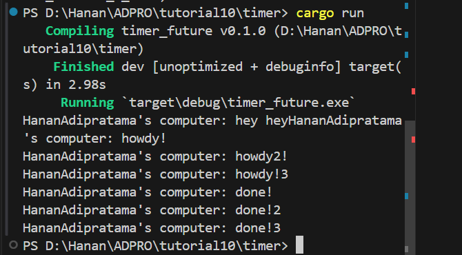

## 1.2

program tidak mencetak "hey-hey" karena executor sudah kosong.

## 1.3
### no drop(spawner)

Executor akan memproses task-task ini secara berurutan. Namun, karena tidak menjatuhkan (drop) spawner, program tidak memberi tahu executor bahwa tidak ada lagi task yang akan ditambahkan.
## with drop(spawner)

Executor akan memproses task-task ini secara berurutan. program berhenti ketika task terakhir sudah dieksekusi.